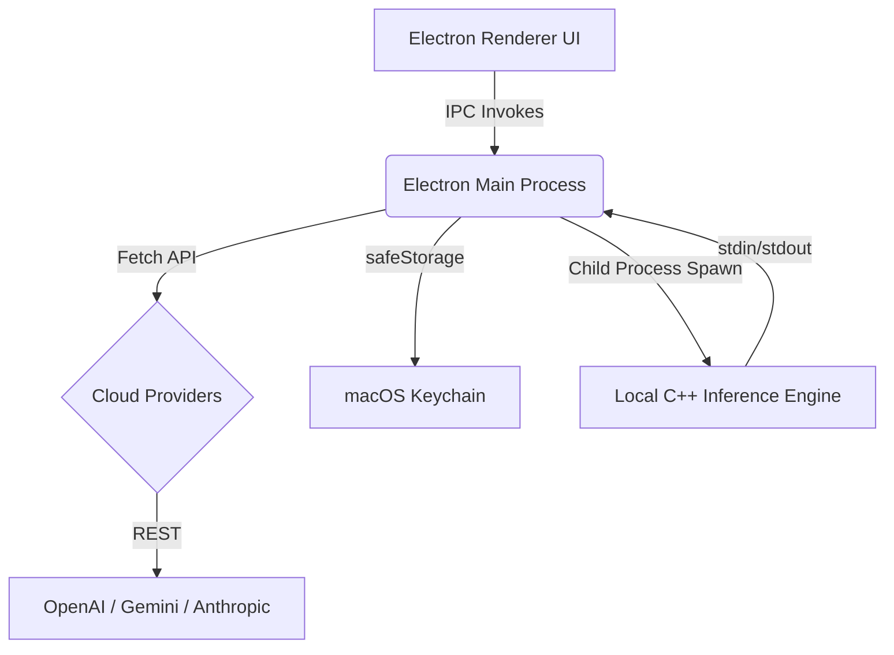

# InferenceOS 🧠⚡️


**InferenceOS** is a lightning-fast, beautifully designed, multi-provider AI chat client built specifically for macOS. It elegantly unifies top-tier cloud LLMs with a high-performance local C++ inference engine into a single, cohesive desktop experience.

---

## 🌟 Key Features

### 🔄 Universal Memory System (UMS)
Never lose context when switching models. InferenceOS features true **ChatGPT-style Chat Branching**, allowing you to maintain multiple independent conversation threads.
*   **Persistent Threads:** All chats are automatically saved and restored on startup.
*   **Model Agnostic:** Start a conversation with Gemini, switch to OpenAI, and finish with Anthropic—all within the same thread. The context follows you.

### 🛡️ Secure Vault
Your API keys are yours. InferenceOS leverages Electron's `safeStorage` API to encrypt your provider keys and store them securely within the native macOS Keychain. Keys are never saved in plaintext.

### 🌐 Multi-Provider Cloud Integration
Instantly access the latest frontier models via their native APIs:
*   **Google Gemini:** Full support for the latest 2026 Gemini 3.x series (`3.1-pro-preview`, `3.5-flash`) and stable 2.5 models. (Includes automatic role-merging logic to prevent `400 Bad Request` errors).
*   **OpenAI:** ChatGPT 3.5 Turbo, GPT-4, etc.
*   **Anthropic:** Claude 3 Haiku, Sonnet, Opus.
*   **Groq:** Blazing fast Llama 3 inference.

### 💻 Local C++ Inference Engine
Off grid? No problem. InferenceOS ships with a custom C++ backend (`InferenceEngine`) running as a highly optimized child process. Chat with local models (like Llama 3) with zero latency and complete privacy.

### 🎨 Stunning UI/UX
*   **Glassmorphism Design:** A premium, translucent dark-mode aesthetic with smooth micro-animations.
*   **Native macOS Integration:** Features a `hiddenInset` title bar for that seamless, native Apple feel.
*   **Robust Error Handling:** API quotas, 404s, and network drops are caught gracefully and printed into the chat bubble instead of crashing the app. (Long error strings perfectly wrap to prevent UI breakage!)

---

## 🏗️ Architecture

The app is built on a robust Electron + Node.js architecture with a C++ sidecar:



*   `main.js`: The heart of the backend. Manages IPC handlers, native OS integrations, secure key storage, chat history serialization, and spawns the C++ backend.
*   `renderer.js`: Drives the dynamic UI, thread switching, DOM updates, and user interactions.
*   `preload.js`: Context isolation bridge exposing secure `window.api` methods.
*   `index.css`: The styling engine powering the glassmorphic aesthetics.
*   `backend/build/InferenceEngine`: The compiled C++ binary for local, offline LLM execution.

---

## 🚀 Getting Started

### Prerequisites
*   macOS
*   Node.js (v18+)
*   npm

### Installation

1. **Clone the repository**
   ```bash
   git clone https://github.com/yourusername/InferenceOS.git
   cd InferenceOS
   ```

2. **Install Dependencies**
   ```bash
   npm install
   ```

3. **Start the Application**
   ```bash
   npm start
   ```

### First Run Setup
1. Open the app and click the **Settings** button in the bottom left.
2. Enter your API keys for the providers you wish to use (OpenAI, Anthropic, Gemini, Groq).
3. Click **Save Keys**. (These are securely encrypted instantly).
4. Click the `+` button in the Chats sidebar to spin up a new thread, select your model from the dropdown, and start chatting!

---

## 🛠️ Development & Troubleshooting

*   **Gemini 400 Errors:** InferenceOS handles Google's strict "alternating roles" requirement under the hood by merging consecutive messages from the same role. 
*   **Gemini 404 Errors:** The model dropdown is hardcoded to the latest 2026 API strings (e.g., `gemini-3.5-flash`). If you receive a 404 or Quota error, check your Google AI Studio billing/region availability.
*   **C++ Backend:** Ensure the `backend/build/InferenceEngine` executable has the proper executable permissions on macOS (`chmod +x`).

---

*Built with ❤️ for macOS power users who demand the best of both local and cloud AI.*
